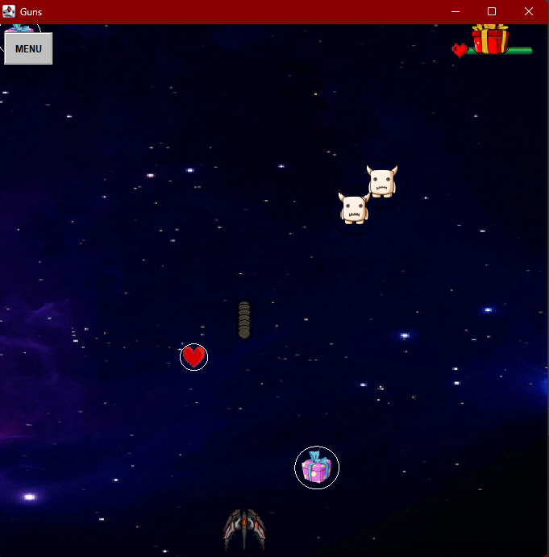
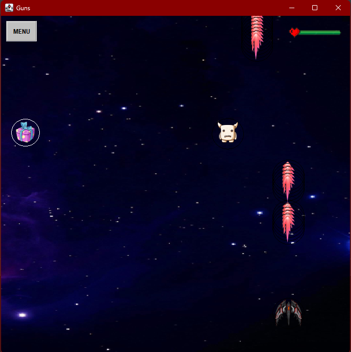
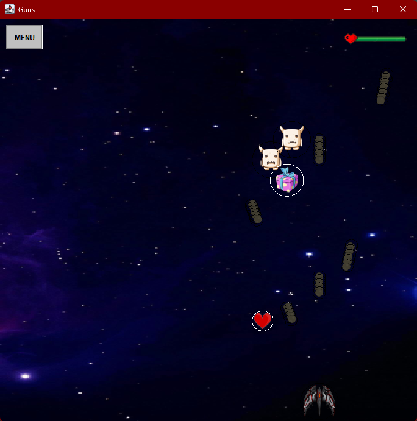

# Chicken invaders Game portion

## Project info
This is a project for my computer graphics course at university of Cairo (Computer Science Faculty).

## Dependencies
* OpenGL
* Jogl
* json-simple
## How to install
* clone this repo using this command : 
> git clone https://github.com/ManarGamal885/GunsGame.git
* download an ide like netbeans
* you can find documentation to download and setup jogl here https://mgayar.blogspot.com/2014/03/how-to-install-jogl11-into-netbeans.html
* download json-simple from here https://www.dropbox.com/sh/wz8kpntgftjpbn9/AADU20oyJyAaYEHFUjRSvNEda?dl=0
* you can add json-simple to the project similerly to jogl

## Features
* Player have health 
* special gift 
*shoot special bullet 
*powerUp to increase score
*collesion with gifts
## Demo

